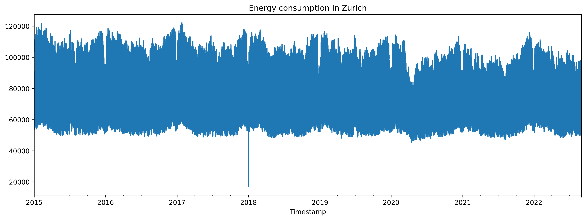
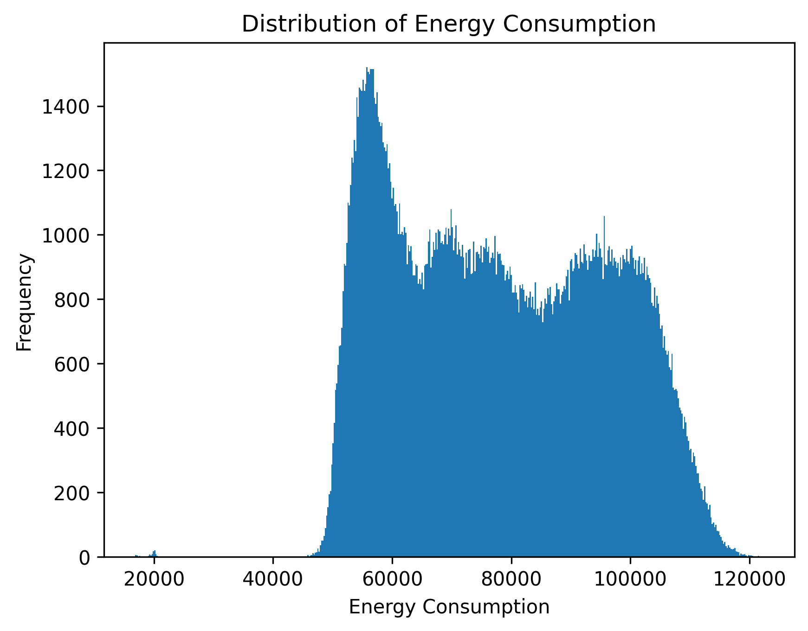
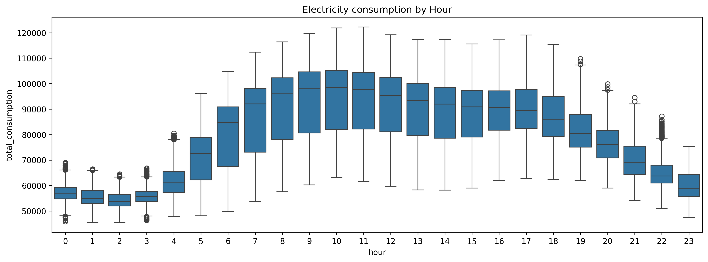
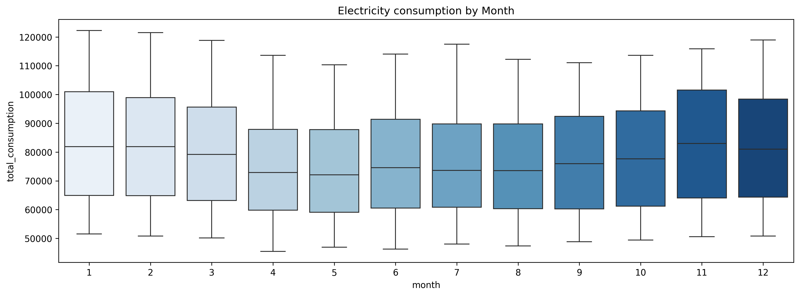
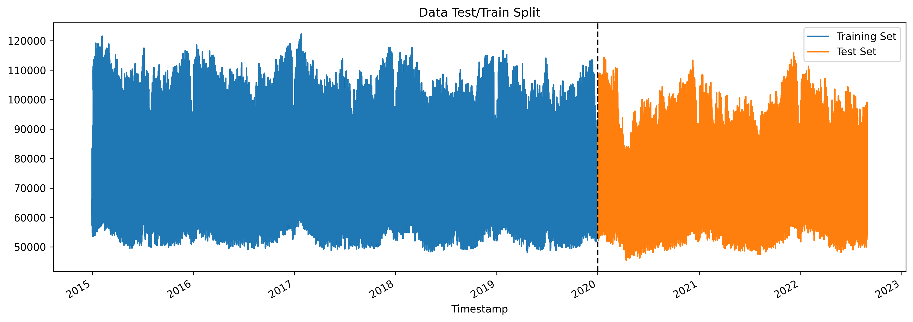
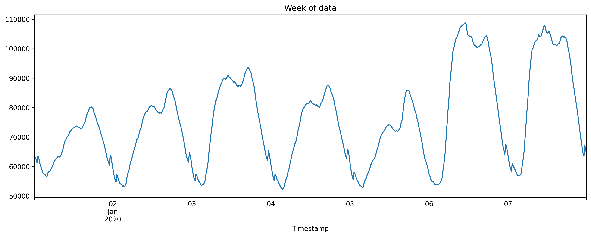
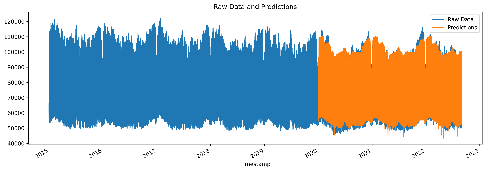
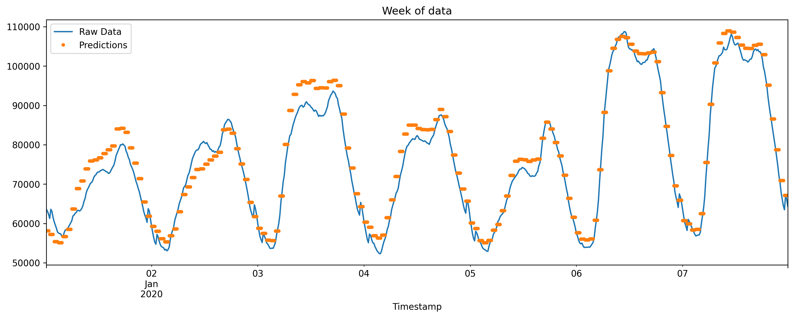
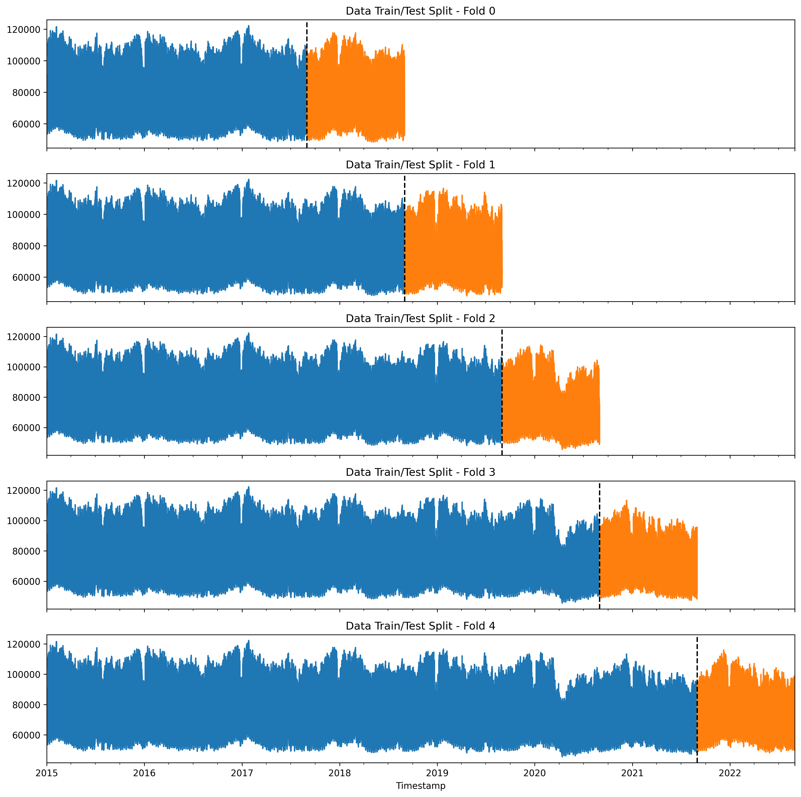
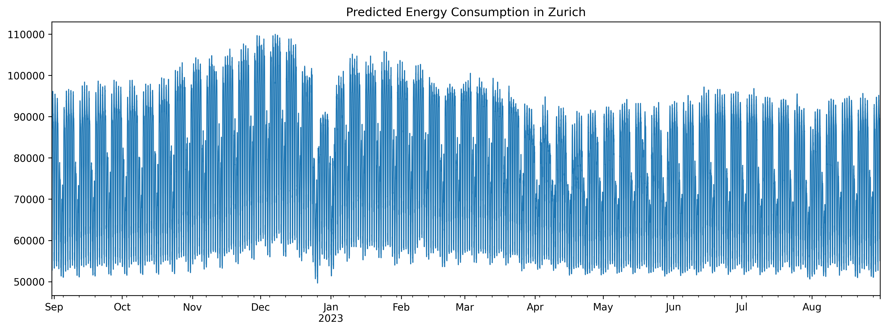

 ##  Zurich Electricity Consumption Forecasting

A machine learning project that forecasts electricity consumption in Zurich, Switzerland using XGBoost and time series cross-validation. The model predicts future energy demand based on historical consumption data and weather features.

---

##  Project Overview

This project uses 15-minute interval electricity consumption data from Zurich (2015–2022) to:

- Explore and visualize consumption patterns by hour, day, and month
- Build an XGBoost regression model with time-based and lag features
- Evaluate performance using RMSE, MAE, and SMAPE
- Validate the model using proper time series cross-validation (no data leakage)
- Forecast electricity consumption one year into the future (Aug 2022 – Aug 2023)

---

##  Results
Test Set Performance (2020 onward):
| Metric | Value |
|--------|-------|
| RMSE | 5443.78 |
| MAE | 3930.36 |
| SMAPE | 5.02% |
> These errors correspond to roughly 4–6% of typical consumption levels, indicating strong predictive accuracy for a high‑variance energy load dataset.

Time‑Series Cross‑Validation (5 folds): 
| Metric | Value |
|--------|-------|
| Cross-Validation RMSE (avg) | **3,875.62** |
| Fold 1 RMSE | 3186.11 |
| Fold 2 RMSE | 3433.50 |
| Fold 3 RMSE | 4429.88 |
| Fold 4 RMSE | 5,022.75 |
| Fold 5 RMSE | 3376.17 |
| Average | 3889.68  |
> Cross‑validation confirms that the model performs consistently across different temporal segments, with RMSE values ranging from ~3.1k to ~5.0k depending on seasonal load variability.

---

##  Project Structure

```
zurich-energy-forecasting/
├──data/
|    └── zurich_electricity_consumption.csv
├── images/
|    └── all images used
├── main-notebook/
|    └── zurichenergy.ipynb      ← Main notebook (EDA + modeling + forecasting)
├── README.md
└── requirements.txt
```

---

##  Dataset

The dataset contains 15-minute interval readings from 2015 to 2022 with the following columns:

| Column | Description |
|--------|-------------|
| `Timestamp` | Date and time of reading |
| `Value_NE5` | Electricity consumption — network level 5 |
| `Value_NE7` | Electricity consumption — network level 7 |
| `T [°C]` | Temperature |
| `Hr [%Hr]` | Relative humidity |
| `RainDur [min]` | Rainfall duration |
| `StrGlo [W/m2]` | Global solar radiation |
| `WVs [m/s]` | Wind speed (scalar) |
| `p [hPa]` | Air pressure |

A `total_consumption` column was engineered as the sum of `Value_NE5` and `Value_NE7`.

---

##  Methodology

### 1. Exploratory Data Analysis
- Visualized electricity consumption across the full time range to understand overall trends:


- Removed outliers (values below 40,000 units) to improve data quality:


- Analyzed temporal patterns using boxplots (hourly and monthly distributions), revealing daily and seasonal demand variations

Hourly Distribution:


Monthly Distribution:


### 2. Feature Engineering
The following features were created from the timestamp index:

- **Time features**: hour, day of week, month, quarter, year, day of year, day of month, week of year
- **Lag features**: consumption from 1 year ago, 2 years ago, and 3 years ago — to capture yearly seasonality

### 3. Initial Model Training & Testing
- **Algorithm**: XGBoost Regressor (`gbtree` booster)
- Initial split:
    - Training set: data before 2020
    - Test set: data from 2020 onward

All Data:


Week of Data:


- **Hyperparameters**: `n_estimators=2000`, `max_depth=3`, `learning_rate=0.01`
- Trained the model on historical data and evaluated performance on the unseen test set to simulate real-world forecasting

Predicted Data:


Predicted Week of Data:


### 4. Validation
- Applied TimeSeriesSplit cross-validation on the training data
- Ensured temporal order was preserved and prevented data leakage
- Used to validate model stability and robustness across multiple time-based splits

Time Series Cross Validation:


### 5. Final Model & Forecasting
- Retrained the model on the full dataset
- Generated future timestamps from Aug 2022 to Aug 2023
- Applied the same feature engineering and lag mapping to future dates

Produced future electricity consumption forecasts for a year:


---

##  How to Run

1. **Clone the repository**
```bash
git clone https://github.com/your-username/zurich-energy-forecasting.git
cd zurich-energy-forecasting
```

2. **Install dependencies**
```bash
pip install -r requirements.txt
```

3. **Launch the notebook**
```bash
jupyter notebook energy_forecasting.ipynb
```

---

##  Requirements

```
pandas
numpy
matplotlib
seaborn
xgboost
scikit-learn
jupyter
```

Or install all at once:
```bash
pip install -r requirements.txt
```

---

##  Potential Improvements

- Incorporate weather features (temperature, humidity, solar radiation) already present in the dataset
- Add `is_weekend` and `is_holiday` binary features
- Experiment with LSTM or Prophet for comparison
- Hyperparameter tuning with Optuna or GridSearchCV

---

##  Author

**Shozen**
- Github: [GitHub Profile](https://github.com/shozenchalla)
- LinkedIn: [LinkedIn Profile](https://www.linkedin.com/in/shozen-challa/)


---

## 📄 License

This project is open source and available under the [MIT License](LICENSE).
